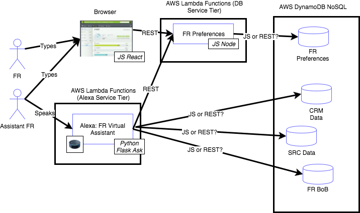

# Design Doc for All Your Base Hackathon Team
Design Documentation for All Your Base Hackathon Team.

## High Level Design Diagram
Here is the high level design of our project.

Each service developer is responsible for writing JS code to populate data into the Dynamo table. See link at bottom of page for more info on how to do this.

### JS React Front End
Assigned: Derek H

Derek writes the front end code for the UX. This screen will have a mockup 

### FR Preferences JS Node Service
Assigned: Derek H

Derek writes this node JS lamda function.
Others on the team can use this code as a model to develop the SRC, CRM and FR BoB services.

### SRC Mock Data Service
Assigned: ???

Develop the SRC Mock Data Service. Supports REST calls from the Python Flask client. 

### CRM Mock Data Service
Assigned: ???

Develop the CRM Mock Data Service. Supports REST calls from the Python Flask client.

### FR BoB Mock Data Service
Assigned: ???

Develop the FR BoB Mock Data Service. Supports REST calls from the Python Flask client.

## Appendix: Dynamo DB Java Script for CRUD Operations Article 

Look at these steps for doing some basic manipulation of docs in Dynamo DB using JS. Note all the prerequisites needed to run code locally and connect to DynamoDB.

http://docs.aws.amazon.com/amazondynamodb/latest/gettingstartedguide/GettingStarted.NodeJs.01.html

This is Scott
